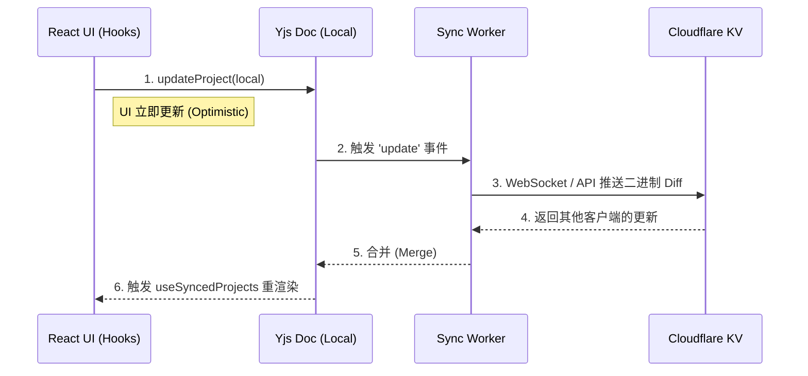

# 📘 Flow Studio 系统架构深度文档

本文档详尽记录了 Flow Studio 的核心设计哲学、全生命周期架构、视觉系统及关键模块实现逻辑。旨在为开发者提供一个**清晰、可视、深度**的代码地图。

---

## 1. 🏗 全局架构设计 (System Architecture)

### 1.1 核心设计哲学
Flow Studio 不仅仅是一个项目管理工具，它是一个**“有机的孵化器”**。
- **有机生长 (Organic Growth)**: 项目不再是冷冰冰的列表项，而是像植物一样经历萌芽、生长、开花的过程。
- **模块化驱动 (Lifecycle-Based Modular)**: 不同的生命周期阶段对应完全独立的 Feature Module，防止界面臃肿，让开发者专注于当下的任务。
- **离线优先 (Local-First)**: 数据优先存储在本地，通过 Yjs 实现静默的云端同步，确保极致的响应速度。

### 1.2 架构概览 (Architecture Diagram)

```mermaid
graph TD
    User((开发者/用户)) --> Navbar[全局导航 Navbar]
    
    subgraph Core_State [核心状态管理]
        Auth[AuthContext]
        Sync[SyncContext (Yjs)]
        Project[ProjectContext]
    end
    
    Navbar --> Auth
    Navbar --> Sync
    
    subgraph Lifecycle_System [生命周期流转系统]
        direction TB
        Stage0[Inspiration 灵感] -->|孵化| Stage1[Pending 待办]
        Stage1 -->|毕业| Stage2[Development 开发]
        Stage2 -->|发布| Stage3[Commercial 商业化]
    end

    Sync <-->|CRDT 同步| Supabase[(Cloudflare/Supabase)]
    Project --> Lifecycle_System
```

---

## 2. 🎨 全局视觉与交互系统 (Visual System)

我们的设计语言追求**“高级感 (Premium)”**与**“生命力 (Vitality)”**。

### 2.1 Rose 色彩系统 (Brand Colors)
我们选用 **Rose (玫瑰色)** 传达热情与创造力。以下是精确的 Tailwind 色值配置：

| Token | Hex Value | 用途说明 |
| :--- | :--- | :--- |
| `rose-50` | `#fff1f2` | 极淡背景，用于大面积留白 |
| `rose-100` | `#ffe4e6` | 次要背景，Card Hover 态 |
| `rose-200` | `#fecdd3` | 弱交互边框 |
| `rose-300` | `#fda4af` | 装饰性元素 |
| `rose-400` | `#fb7185` | 次要按钮 / 高亮提示 |
| **`rose-500`** | **`#f43f5e`** | **主要品牌色，平衡视觉重心** |
| `rose-600` | `#e11d48` | 主要交互色 (Button Hover) |
| `rose-700` | `#be123c` | 深色强调文本 |
| `rose-800` | `#9f1239` | 标题文本 (Dark Mode 适配) |
| `rose-900` | `#881337` | 极深色块，用于页脚或强调 |

### 2.2 定义层 CSS 变量
定义于 `src/index.css`，用于实现全局的一致性与潜在的 Dark Mode 切换能力。

```css
:root {
    --bg-primary:   #ffffff;  /* 卡片、弹窗背景 */
    --bg-secondary: #f8f9fa;  /* 应用底层背景 */
    --text-primary: #1a1a1a;  /* 主要内容文本 */
    --text-secondary: #666666; /* 辅助说明文本 */
}
```

---

## 3. 🧩 核心业务模块详解 (Core Modules)

### 3.1 🌱 Lifecycle Components (生命周期)
路径: `src/features/lifecycle`

#### **PendingModule (孵化阶段)**
这是项目的“胚胎期”。我们不仅是记录待办，更是**强制思考**。

- **核心功能**: 
  - **价值拷问 (Unique Insight)**: 用户必须回答关于“长期价值”和“利他之心”的问题。
  - **树苗可视化 (Visual Growth)**: 随着回答的深入，树苗会视觉上长大。

- **关键函数解析**:
| 函数名 | 核心逻辑与设计意图 |
| :--- | :--- |
| `handleAnswer(projectId, qId, val)` | **逻辑**: 更新项目的元数据 `metadata.answers`。<br>**意图**: 将“思考”量化为数据，作为项目是否值得开发的判断依据。 |
| `getSaplingState(score)` | **逻辑**: 根据 `score` (0-100) 返回 `seed` -> `sprout` -> `sapling`。<br>**意图**: 即时反馈 (Instant Feedback)，让用户感知到投入带来的变化。 |
| `handleGraduate(project)` | **逻辑**: 将项目 `stage` 字段从 1 (Pending) 更新为 2 (Dev)。<br>**意图**: 充满仪式感的“毕业”，标志着从构思转向执行。 |

#### **CommercialModule (商业化阶段)**
路径: `src/features/lifecycle/CommercialModule.jsx`

- **核心功能**: 帮助开发者选择合适的变现路径。
- **关键数据结构**:
    ```javascript
    const STRATEGIES = [
        { id: 'freemium', title: 'Freemium', desc: '免费增值模式' },
        { id: 'ads', title: 'Ad-Supported', desc: '广告变现' }
    ];
    ```
- **构建逻辑**: 
    - 使用 `UpdateStrategy` 组件渲染卡片网格。
    - 点击卡片触发 `handleUpdate`，将商业模式直接写入项目配置，与代码逻辑解耦但数据绑定。

### 3.2 🛠 Command Center (指令中心)
路径: `src/features/commands`

**定位**: 开发者的“外脑”与“兵工厂”。

- **CommandCenterModule.jsx**:
  - **拖拽排序**: 利用 `dnd-kit` 或即兴的数组重排逻辑，实现指令优先级的自定义。
  - **一键导入**: `handleImport` 函数将指令从“库”中复制到当前活跃的“项目任务”中。
  - **设计细节**: 
    - 所有的指令都有 `category` 属性。
    - 侧边栏的分类重命名功能 (`CategoryRenameModal`) 允许用户建立自己的知识体系。

---

## 4. 🔄 分布式同步引擎 (Sync Engine)

### 4.1 技术选型
路径: `src/features/sync`
我们放弃了传统的 REST API，拥抱 **Local-First** 架构。

### 4.2 SyncEngine (SyncEngine.js)


- **核心组件**:
  - **`useSyncedProjects` Hook**: 
    - 这里不仅是获取数据，还负责将 `Y.Array` 的复杂操作封装成简单的 React API (`add`, `remove`, `update`)。
    - 它屏蔽了 CRDT 的复杂性，让上层业务逻辑像操作普通数组一样简单。

---

## 5. 🚀 总结

Flow Studio 的代码库是一个**高度内聚、低耦合**的有机体：
1. **视觉上**：通过 Rose 色系和动态 SVG 反馈，打造“不仅好用，而且动人”的体验。
2. **逻辑上**：严格遵循生命周期，让代码结构清晰可维护。
3. **数据上**：利用 Yjs 实现无感同步，顺应 Local-First 的现代 Web 趋势。

> **Next Step**: 如果需要新增生命周期阶段，只需在 `src/features/lifecycle` 创建新文件并在 `StageNavigation` 注册即可。
